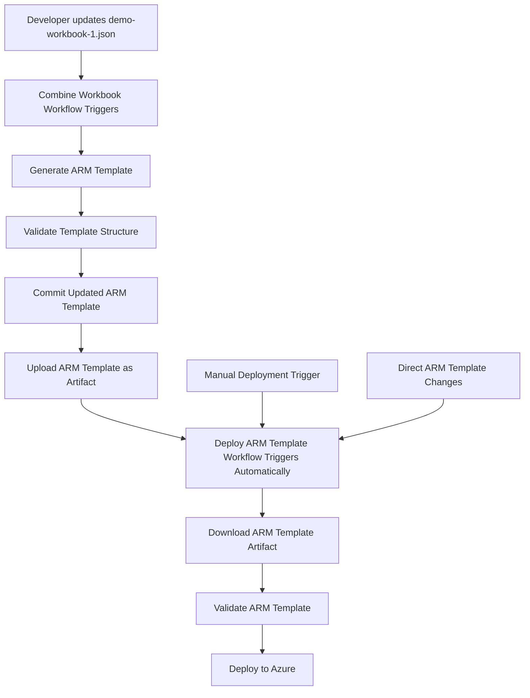

# Automated Pipeline Configuration

## Overview
The deployment pipeline is now configured to automatically run the ARM template deployment after the workbook combination workflow completes successfully.

## Workflow Chain Configuration

### 1. Combine Workbook Workflow (`combine-workbook-into-arm.yml`)
**Triggers:**
- Push to main branch (changes to `demo-workbook-1.json`)
- Pull requests affecting workbook files
- Manual dispatch with force update option

**Actions:**
1. Generate ARM template using PowerShell script
2. Validate generated template structure
3. Commit changes if ARM template is updated
4. **Upload ARM template as artifact** (for deployment workflow)

### 2. Deploy ARM Template Workflow (`deploy-arm-template.yml`)
**Triggers:**
- **Automatic trigger**: After "Combine Workbook into ARM Template" workflow completes successfully
- Manual push to main branch (changes to ARM template)
- Pull requests affecting related files
- Manual dispatch for direct deployment

**Conditions:**
- Only runs if the combine workflow was successful (`workflow_run.conclusion == 'success'`)
- Downloads the ARM template artifact from the combine workflow
- Maintains existing deployment logic for other trigger types

## Pipeline Flow

## Key Features

### Automatic Chaining
- Deploy workflow automatically triggers when combine workflow completes successfully
- No manual intervention required for the full pipeline

### Artifact Handling
- ARM template is uploaded as an artifact with 1-day retention
- Deploy workflow downloads the latest ARM template from the combine workflow
- Ensures deployment uses the exact template generated by the combine process

### Conditional Execution
- Deploy workflow only runs if combine workflow was successful
- Maintains backward compatibility for manual deployments
- Proper error handling and validation at each stage

### Validation Chain
- Combine workflow validates workbook structure and ARM template syntax
- Deploy workflow validates ARM template before deployment
- Comprehensive error reporting and debugging information

## Usage

### Automatic Pipeline (Recommended)
1. Update `demo-workbook-1.json` with your workbook changes
2. Commit and push to main branch
3. **Combine workflow automatically runs** → generates ARM template
4. **Deploy workflow automatically runs** → deploys to Azure
5. Monitor both workflows in GitHub Actions

### Manual Deployment
1. Use workflow dispatch on deploy ARM template workflow
2. Provide required inputs (resource group, location)
3. Deploy directly without waiting for combine workflow

## Monitoring

Both workflows provide comprehensive summaries and status updates:
- **Combine Workflow**: Reports template generation status, validation results, and file changes
- **Deploy Workflow**: Reports deployment status, resource creation, and Azure integration

The automated pipeline ensures your workbook changes are immediately available in Azure without manual intervention!